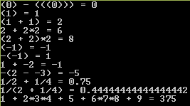

# Лабораторная работа №5
### Задание
В программе имеется ряд дефектов. Необходимо их локализовать и исправить, руководствуясь информацией ниже.  
Каждое исправление должно быть оформлено отдельно, с подробным описанием проблемы, случаях возникновения и обоснованием предложенного решения.  
В случае обнаружения проблемы, но невозможности предложить решение, достаточно описать причины её возникновения.  
Файл input.txt, из которого считываются выражения, можно расширять своими примерами.  

##### Рекомендации
- Не надо исправлять то, что не является дефектом.
- Не надо переписывать весь код. Ошибок в глобальной логике программы нет, каждый дефект можно исправить локально, изменив всего несколько строк. Или даже символов.
- Дефекты не обязательно приводят к ошибкам. Ищите скрытые дефекты, если программа делает вид, что работает правильно.
- Сначала ищите дефекты, приводящие к неработоспособности программы в простых случаях, а потом в граничных.
- Статический счетчик, который инкрементирется в конструкторе класса и декрементируется в его деструкторе, поможет найти утечки памяти.
- Проверьте работу с некорректными входными данными.

### Требования к программе
##### Программа должна:
- Принимать имя файла в качестве единственного параметра командной строки.
- Считывать построчно математические выражения из этого файла.
- Одна строка - одно выражение, пустые строки не обрабатываются.
- Для каждой строки выводить результат подсчёта выражения

##### Программа не должна:
- Падать или зависать при любых обстоятельствах.
- Досрочно завершаться в случае ошибок в выражениях.
- Иметь утечки ресурсов любого рода. 
- Выдавать некорректное значение выражения, даже в случае некорректного выражения.

##### Правила записи выражений
- Все пробелы в выражении игнорируются.
- Все числа в выражении должны быть целыми.
- Любое целое неотрицательное число - это выражение. Ведущие нули допускаются.
Примеры: 0, 1, 100, 042
- Любое выражение в скобках - это выражение. Множественное вложение допускается.
Примеры: (1+1), (2+2)*2, (1), (0)-(((0)))
- Отрицание выражения - это выражение. Не допускается несколько отрицаний подряд.
Унарный минус не обязательно заключать в скобки.
Примеры: -1, -(1), (-1), -(-1), 1 + -2, -(2 - -3)
- Сумма, разность, произведение и отношение выражений - это выражение. Приоритеты операций соответствуют правилам математики.
Примеры: 2 + 2, 1 + 1/3, 1/2 + 1/4, 1/(2 + 1/4), 1 + 2\*3\*4 + 5 + 6\*7\*8 + 9

##### Примеры
| Выражение                     | Значение |
|-------------------------------|----------|
| (0) - (((0)))                 | 0        |
| (1)                           | 1        |
| (1 + 1)                       | 2        |
| 2 + 2*2                       | 6        |
| (2 + 2)*2                     | 8        |
| (-1)                          | -1       |
| -(-1)                         | 1        |
| 1 + -2                        | -1       |
| -(2 - -3)                     | -5       |
| 1/2 + 1/4                     | 0.75     |
| 1/(2 + 1/4)                   | 0.4444   |
| 1 + 2\*3\*4 + 5 + 6\*7\*8 + 9 | 375      |

##### Пример вывода эталонной программы

##### Структура программы

Программа принимает в качестве первого аргумента командной строки имя файла, который надо прочитать.
Для корректного запуска программы из Visual Studio его нужно указать в настройках проекта:
- Открыть свойства проекта;
- В группе Configuration Properties открыть вкладку Debugging;
- В поле Command Arguments ввести имя файла, по умолчанию - input.txt

Файл **main.cpp** содержит общий код, отвечающий за чтение строк из файла и вывод на экран выражений, значений и сообщений об ошибках.

Файлы **Expression.h/cpp** содержат алгоритмический код, который относится к чтению строки и созданию дерева выражений.

Абстрактный класс **IException** не имеет полей, но в нем есть статический счетчик, увеличивающийся на 1 при каждом вызове конструктора и уменьшающийся на 1 при каждом вызове деструктора этого класса.

Статическая функция **IExpression::GetDebugCounter** позволяет получить значение счетчика.

Статическая функция **IExpression::Parse** создает дерево выражения из строки и бросает исключение в случае ошибки.

Функция **IExpression::Compute** вычисляет и возвращает значение выражения. Это - вирутальная функция, перегруженная в каждом наследнике, поэтому значение выражения вычисляется в соответствии с его реальным типом.
